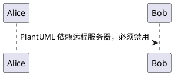
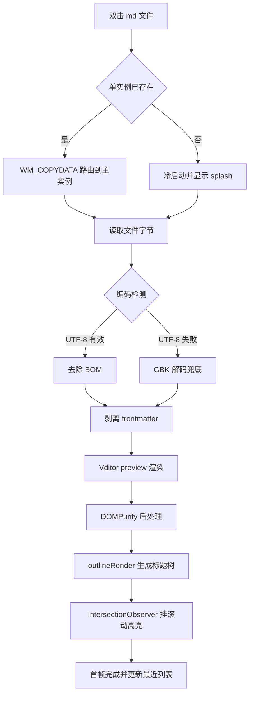
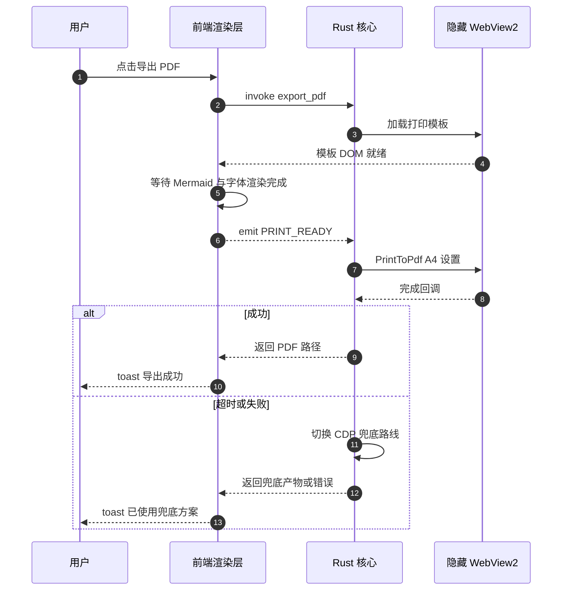

# MDNaonao 渲染基准文档

> 本文件是 `test-corpus/` 的核心基准语料。它有三重身份：
> ① 渲染回归基准（M1 出口逐条核对）；② 导出 PDF / 长图 / 富文本的**视觉基准**；③ `scripts/gen-corpus.mjs` 生成 `big-10mb.md` 的拼接源。
> 修改本文件前请先确认：DG 12.0 要求的元素一个都不能少，否则压测语料的元素密度会随之失真。

本文档正文以中文技术文档口吻撰写，段落中刻意混排 English words 与数字 3.11.3，用于验证 Vditor 的 autoSpace 行为——例如这一句里的"渲染内核Vditor"与"版本v3.11.3"故意**没有**加空格，渲染后应自动补齐中西文间距；而"渲染内核 Vditor"与"版本 v3.11.3"本来就有空格，不应被加成两个。

---

## 1. 标题层级（H1–H6）

本节验证六级标题全部被 `outlineRender()` 采集，且大纲缩进正确。

### 1.1 三级标题：模块划分

#### 1.1.1 四级标题：渲染层

##### 1.1.1.1 五级标题：滚动高亮子系统

###### 1.1.1.1.1 六级标题：IntersectionObserver 回调节流

六级标题在大纲面板中应仍可点击跳转；若大纲只采集到 H1–H3，即为缺陷。

---

## 2. 行内格式

普通文本、**加粗文本**、*斜体文本*、***加粗斜体***、~~删除线~~、`行内代码`、<mark>高亮标记</mark>、上标 X<sup>2</sup> 与下标 H<sub>2</sub>O。

组合场景：**加粗中的 `行内代码` 与 *嵌套斜体*** 应同时生效；~~删除线里的 [链接](https://v2.tauri.app/)~~ 仍应可点击。

转义字符：`\*` 不应变成斜体，反斜杠转义后的星号 \*字面星号\*、下划线 \_字面下划线\_、井号 \# 不成标题。

HTML 实体：&amp; &lt; &gt; &quot; &copy; &mdash; &nbsp;（不间断空格前后各有一个字）。

---

## 3. 列表

### 3.1 无序列表与嵌套

- 一级：渲染管线
  - 二级：读文件（UTF-8 优先，BOM 去除）
    - 三级：失败按 GBK 解码兜底
      - 四级：状态栏显示实际编码
  - 二级：剥离 frontmatter
- 一级：导出管线
  - 二级：HTML（单文件 / 资源目录两种模式）
  - 二级：PDF（主路线 PrintToPdf，兜底 CDP）

### 3.2 有序列表与混合嵌套

1. 建仓与脚手架
2. PDF 静默导出 PoC
   1. `cargo tree` 核对 webview2-com 版本
   2. 手写静态打印测试页
   3. COM 调用链打通
      - 超时设置为 30s
      - 完成回调经 channel 桥回 async command
3. Vditor 实测包
   1. 按白名单搭 `vendor/vditor/`
   2. 全语料渲染回归

### 3.3 松散列表（段落型条目）

- **第一条**：条目内含独立段落。

  这是同一条目的第二段，验证松散列表的段落间距不塌陷。

- **第二条**：条目内含代码块。

  ```bash
  pnpm gen:corpus
  ```

### 3.4 任务列表

- [x] 文件关联（五个扩展名）
- [x] 单实例路由
- [ ] 大纲钉住态滚动高亮
- [ ] 导出 PDF 主路线
  - [x] 版本对齐
  - [ ] 完成回调超时处理
- [ ] 飞书进阶通道四步引导

---

## 4. 表格

### 4.1 对齐方式

| 左对齐 | 居中对齐 | 右对齐 | 默认对齐 |
| :--- | :---: | ---: | --- |
| 文件关联 | P0 | 1.5 天 | M1 |
| 大纲钉住 | P0 | 2 天 | M1 |
| 长图分页拼接 | P1 | 3 天 | v1.1 |
| 单元格内 `行内代码` | **加粗** | *斜体* | [链接](https://v2.tauri.app/) |

### 4.2 超宽表格（横向滚动 / PDF 缩放基准）

下表 14 列，中文列头较长，用于验证：预览区出现横向滚动条而非撑破布局；导出 PDF 时表格完整不被裁切；粘贴到公众号编辑器后不塌。

| 序号 | 指标名称 | 目标值 | 实测值（基准机） | 采集方式 | 采集工具 | 是否达标 | 责任模块 | 关联 FR | 里程碑 | 风险等级 | 降级预案 | 最近验证日期 | 备注说明 |
| ---: | --- | --- | --- | --- | --- | :---: | --- | --- | --- | :---: | --- | --- | --- |
| 1 | 安装包体积 | ≤ 25MB | 待测 | NSIS 产物实测 | 资源管理器属性 | 待定 | bundler | — | v1.0 | 中 | 进一步裁剪 KaTeX 字体子集 | 待回填 | Vditor 资源按白名单裁剪后打入 |
| 2 | 内存（空载） | ≤ 150MB | 待测 | 专用工作集求和 | Process Explorer | 待定 | 全局 | — | M1 | 中 | 关闭预渲染缓存 | 待回填 | 主进程 + 全部 WebView2 子进程 |
| 3 | 内存（10MB 文档） | ≤ 250MB | 待测 | 专用工作集求和 | Process Explorer | 待定 | render | FR-01 | M1 | 高 | 缩小分段渲染窗口 | 待回填 | 超 250MB 视为 bug |
| 4 | 热启动首帧 | ≤ 1000ms | 待测 | 性能日志打点 | tracing 日志 | 待定 | cmdline | FR-12 | M1 | 高 | 缓存上次布局尺寸 | 待回填 | 自单实例回调至首帧渲染完成 |
| 5 | 冷启动首帧 | ≤ 3000ms | 待测 | 高速摄像 | 手机 240fps | 待定 | 全局 | — | M1 | 中 | splash 提前显示 | 待回填 | 含 ≤300ms splash |
| 6 | 10MB 滚动帧率 | ≥ 50fps | 待测 | 帧率面板均值 | DevTools Performance | 待定 | render | FR-01 | M1 | 高 | 关闭实时滚动高亮改节流 | 待回填 | 分段渲染下口径 |
| 7 | XSS 样本通过率 | 100% | 待测 | 逐样本人工核对 | DevTools Network | 待定 | render | — | M1 | 高 | 无（红线，不可降级） | 待回填 | 见 `xss-suite/` 全部样本 |
| 8 | 外网请求数 | 0 | 待测 | 网络面板计数 | DevTools Network | 待定 | render | — | M1 | 高 | 无（红线，不可降级） | 待回填 | 外链图片默认占位不加载 |

### 4.3 空单元格与管道转义

| 场景 | 值 | 说明 |
| --- | --- | --- |
| 空值 |  | 中间单元格为空 |
| 管道符 | `a \| b` | 单元格内需转义竖线 |
| 换行 | 第一行<br>第二行 | 用 `<br>` 强制换行 |

---

## 5. 引用块

> 一级引用：阅读区滚动与刷新零动画，重渲染必须原位无闪烁。
>
> > 二级嵌套引用：双缓冲策略——新内容渲染完成后一次性替换 DOM，保持滚动位置。
> >
> > > 三级嵌套引用：`prefers-reduced-motion` 开启时全部动效时长归零。

引用块内含其他元素：

> ### 引用块内的标题
>
> 引用块内的列表：
>
> 1. 第一项
> 2. 第二项
>
> 引用块内的代码：
>
> ```js
> console.log('引用块内的代码块');
> ```
>
> | 引用块内 | 的表格 |
> | --- | --- |
> | A | B |

---

<a id="code-blocks"></a>

## 6. 代码块与语法高亮

### 6.1 JavaScript

```js
// 渲染入口：Vditor.preview + DOMPurify 后处理（注释为中文，标识符为英文）
import DOMPurify from 'dompurify';

export async function renderMarkdown(container, markdown, options) {
  const html = await window.Vditor.preview(container, markdown, {
    cdn: options.localCdnPath, // 硬性规定：必须指向本地自托管目录
    mode: options.theme === 'dark' ? 'dark' : 'light',
    markdown: { sanitize: true, autoSpace: true, footnotes: true },
    math: { engine: 'KaTeX', inlineDigit: true },
    hljs: { enable: true, lineNumber: false, style: 'github' },
    after: () => container.dispatchEvent(new CustomEvent('PREVIEW_READY')),
  });
  return DOMPurify.sanitize(html, { USE_PROFILES: { html: true, svg: false, mathMl: false } });
}

// ↓↓↓ 超长单行（约 520 字符）：验证代码块横向滚动、PDF 自动换行不截断、复制按钮定位不飘 ↓↓↓
const RENDER_PIPELINE_STAGE_ORDER = ['read-file-bytes', 'strip-utf8-bom', 'detect-encoding-utf8-first', 'fallback-decode-gbk-when-utf8-invalid', 'split-yaml-frontmatter', 'build-property-card-model', 'chunk-markdown-by-heading-for-large-documents', 'render-first-viewport-chunk-with-vditor-preview', 'sanitize-rendered-html-with-dompurify', 'render-remaining-chunks-in-idle-callback', 'extract-heading-tree-with-outline-render', 'attach-intersection-observer-for-scroll-highlight', 'restore-last-scroll-anchor-offset', 'update-recent-files-store', 'emit-first-frame-rendered-metric'];
```

### 6.2 Rust

```rust
//! 导出模块：所有 command 返回 Result<T, AppError>（thiserror 定义）

use std::path::PathBuf;
use std::time::Duration;

/// PDF 导出主路线：等待前端 PRINT_READY 后调用 WebView2 的 PrintToPdf。
#[tauri::command]
pub async fn export_pdf(app: tauri::AppHandle, source: PathBuf, target: PathBuf) -> Result<PathBuf, AppError> {
    let settings = PrintSettings::a4()
        .with_margins(Margins::mm(15.0, 15.0, 18.0, 15.0))
        .without_header_footer();

    // 注意：此处顺序不能变——必须先挂完成回调再触发打印，否则快文档会丢事件
    let (tx, rx) = tokio::sync::oneshot::channel::<Result<(), AppError>>();
    webview::print_to_pdf(&app, &target, settings, tx)?;

    match tokio::time::timeout(Duration::from_secs(30), rx).await {
        Ok(Ok(Ok(()))) => Ok(target),
        Ok(Ok(Err(err))) => Err(err),
        Ok(Err(_)) => Err(AppError::PrintChannelClosed),
        Err(_) => Err(AppError::PrintTimeout { seconds: 30 }),
    }
}

#[cfg(test)]
mod tests {
    use super::*;

    #[test]
    fn a4_settings_should_disable_header_and_footer() {
        let settings = PrintSettings::a4().without_header_footer();
        assert!(!settings.header_enabled());
        assert!(!settings.footer_enabled());
    }
}
```

### 6.3 Python

```python
# -*- coding: utf-8 -*-
"""语料统计脚本：核对 big-10mb.md 的元素密度是否满足 DG 12.0 的下限要求。"""

import re
from pathlib import Path

HEADING = re.compile(r"^#{1,6}\s+\S", re.MULTILINE)
FENCE = re.compile(r"^```", re.MULTILINE)
TABLE_ROW = re.compile(r"^\|.+\|$", re.MULTILINE)


def summarize(path: Path) -> dict[str, int]:
    text = path.read_text(encoding="utf-8")
    return {
        "bytes": len(text.encode("utf-8")),
        "headings": len(HEADING.findall(text)),
        "code_blocks": len(FENCE.findall(text)) // 2,
        "table_rows": len(TABLE_ROW.findall(text)),
    }


if __name__ == "__main__":
    stats = summarize(Path("test-corpus/big-10mb.md"))
    assert stats["headings"] >= 500, f"标题数不足：{stats['headings']}"
    assert stats["code_blocks"] >= 100, f"代码块不足：{stats['code_blocks']}"
    print(stats)
```

### 6.4 Bash

```bash
#!/usr/bin/env bash
set -euo pipefail

# 常规长度命令
pnpm lint && pnpm test && pnpm check:no-cdn

# ↓↓↓ 超长单行（约 480 字符）：验证 shell 代码块不换行时的横向滚动与打印换行 ↓↓↓
find ./src ./src-tauri/src ./scripts ./test-corpus -type f \( -name '*.ts' -o -name '*.tsx' -o -name '*.rs' -o -name '*.mjs' -o -name '*.md' \) -not -path '*/node_modules/*' -not -path '*/target/*' -print0 | xargs -0 grep -n -E 'unpkg\.com|cdn\.jsdelivr\.net|cdnjs\.cloudflare\.com|fastly\.jsdelivr\.net' --color=always | sed -E 's/^([^:]+):([0-9]+):/\1 第 \2 行 -> /' | sort -u | tee ./logs/no-cdn-scan-result.txt && echo "扫描完成：若上方有任何输出即构建失败（红线 8）"
```

### 6.5 无语言标注与纯文本

```
无语言标注的代码块：不应被高亮，也不应被当作 HTML 解析。
<script>alert('此处仅为纯文本，不应执行')</script>
```

行内代码的边界情况：`` `含反引号的行内代码` ``、`<div onclick="alert(1)">行内代码里的 HTML 不应生效</div>`。

### 6.6 被禁用的图表类型（应降级为普通代码块）



```echarts
{ "title": { "text": "执行型图表默认关闭，应展示为代码" } }
```

---

## 7. Mermaid 图表

### 7.1 流程图



### 7.2 时序图



---

## 8. KaTeX 数学公式

行内公式：设文档块数为 $n$，单块渲染耗时为 $t_i$，则总耗时约为 $\sum_{i=1}^{n} t_i$；当 $n > 500$ 时启用分段渲染。行内公式与中文的间距也属于 autoSpace 验收范围。

块级公式：

$$
T_{\text{render}} \approx \sum_{i=1}^{n} \Bigl( t_{\text{parse}}(b_i) + t_{\text{layout}}(b_i) + t_{\text{paint}}(b_i) \Bigr)
$$

多行对齐：

$$
\begin{aligned}
M_{\text{total}} &= M_{\text{main}} + \sum_{k=1}^{m} M_{\text{webview}_k} \\
                 &\le 250\ \text{MB} \quad (\text{10MB 文档场景}) \\
                 &\le 150\ \text{MB} \quad (\text{空载场景})
\end{aligned}
$$

矩阵与分数：

$$
A = \begin{bmatrix} 1 & 0 & 0 \\ 0 & \cos\theta & -\sin\theta \\ 0 & \sin\theta & \cos\theta \end{bmatrix}, \qquad
P(\text{命中}) = \frac{\left| \{ x \mid x \in D,\ \text{match}(x, q) \} \right|}{|D|}
$$

美元符号不应被误判为公式：本次预算为 $25 到 $30 之间（此处两个美元符号之间是普通文本，不应被渲染成公式）。

---

## 9. 链接矩阵（FR-15 验收基准）

| 链接类型 | 示例 | 预期行为 |
| --- | --- | --- |
| 外部链接 | [Tauri 2 官方文档](https://v2.tauri.app/) | 默认浏览器打开，悬停时状态栏显示完整 URL |
| 裸 URL 自动链接 | https://github.com/Vanessa219/vditor | GFM autolink 生效，行为同外部链接 |
| 相对 .md 链接 | [超长内容压测语料](./longlines.md) | 本应用内打开并计入最近列表 |
| 相对 .md（中文空格路径） | [中文空格路径附件文档](<./assets-cn path/图 片.md>) | 同上，且路径解码正确 |
| 相对 .md（子目录） | [XSS 样本：script 标签](./xss-suite/01-script-tag.md) | 同上 |
| 文内锚点（显式） | [跳到第 6 节代码块](#code-blocks) | 文内平滑跳转（250ms） |
| 文内锚点（自动生成） | [跳到第 4 节表格](#4-表格) | 依赖 Lute 的 heading id 生成规则，需实测确认 |
| 邮件链接 | <mailto:noreply@example.invalid> | 交由系统默认邮件客户端 |
| 引用式链接 | [引用式写法][ref-tauri] | 与内联写法行为一致 |
| 标题带引号的链接 | [带 title 的链接](https://v2.tauri.app/ "悬停显示此标题") | title 属性保留 |

[ref-tauri]: https://v2.tauri.app/plugin/single-instance/

右键任意链接应提供"复制链接"。

---

## 10. 图片

> **注意**：本仓库不提交二进制图片（见 `test-corpus/README.md` 的"图片资源"一节）。
> 按 README 放置图片后，本节应全部正常显示；未放置时，本节即是**图片加载失败占位**的回归用例。

### 10.1 相对路径（同目录 assets）


### 10.2 中文 + 空格路径（头号坑）

尖括号写法：


百分号编码写法：


### 10.3 外链图片（默认不发起网络请求）


预期：显示占位条，hover 显示完整 URL，未点击"加载"前 DevTools Network 中**零请求**。

### 10.4 带链接的图片与 title

[](https://v2.tauri.app/)

### 10.5 图片加载失败


---

## 11. 脚注

Vditor 的脚注能力由 Lute 的 GFM 扩展覆盖，无需额外插件[^lute]。滚动高亮为自研实现[^scroll]，而长图截图只能走 CDP 路线[^capture]。

[^lute]: 脚注、任务列表、表格均属 GFM 扩展，由 Lute 内置支持。脚注定义可以出现在文档任意位置，渲染后统一归集到文末。
[^scroll]: 官方未提供大纲滚动高亮，需自行用 IntersectionObserver 监听 heading 元素；大文件下改为 500ms 节流。
[^capture]: CapturePreview 仅能截取可视区（微软官方确认为设计行为），因此长图唯一路线是 CDP `Page.captureScreenshot` 且 `captureBeyondViewport: true`。

---

## 12. 内联 HTML（良性 HTML 不应被过度消毒）

<details>
<summary>点击展开：折叠块内的内容</summary>

折叠块内可以包含**完整的 Markdown**：

- 列表项一
- 列表项二

```js
console.log('折叠块内的代码块');
```

</details>

键盘键：按 <kbd>Ctrl</kbd> + <kbd>F</kbd> 唤起查找浮条，按 <kbd>Esc</kbd> 关闭并归还焦点。

定义列表（HTML 写法）：

<dl>
  <dt>ProgID</dt>
  <dd>注册表中文件类型到应用的映射标识。</dd>
  <dt>CF_HTML</dt>
  <dd>Windows 剪贴板 HTML 格式，粘贴富文本靠它。</dd>
</dl>

行内元素：<abbr title="Chrome DevTools Protocol">CDP</abbr>、<code>&lt;code&gt; 标签</code>、<em>强调</em>、<strong>重要</strong>、<small>小字号</small>。

表格的 HTML 写法：

<table>
  <thead>
    <tr><th>模式</th><th>产物</th></tr>
  </thead>
  <tbody>
    <tr><td>单文件</td><td>图片 base64 内联</td></tr>
    <tr><td>资源目录</td><td>xxx_files/ 同级目录</td></tr>
  </tbody>
</table>

> **消毒边界说明**：以上标签均为良性内容，DOMPurify 默认白名单应予保留。
> 若本节被整体清空，说明消毒策略过严，属于回归缺陷；恶意样本请见 `xss-suite/`。

---

## 13. 中英混排与排版细节（autoSpace 验收）

**未加空格组（渲染后应自动补齐间距）**：本项目使用Tauri 2作为壳，前端为React 18与TypeScript，渲染内核选用Vditor 3.11.3，数学公式引擎固定为KaTeX，代码高亮为highlight.js，包管理器为pnpm，Node版本要求20以上，安装包体积上限25MB。

**已加空格组（渲染后不应变成双空格）**：本项目使用 Tauri 2 作为壳，前端为 React 18 与 TypeScript，渲染内核选用 Vditor 3.11.3，数学公式引擎固定为 KaTeX。

**标点混排**：中文句号。英文句点. 中文逗号，英文逗号, 中文引号"引用内容"与英文引号"quoted text"，中文括号（说明）与英文括号 (note)，中文书名号《开发指南》，省略号……破折号——分隔。

**数字与单位**：10MB、250MB、1000ms、≥50fps、25MB±5%、±4px、100%/125%/150%/200%。

**长段落（换行与两端对齐基准）**：MDNaonao 是一款严格只读的 Windows 轻量 Markdown 查看器，核心价值在于"双击即看"——文件关联、单实例路由、最近列表、可钉住大纲、文档内查找、外部修改自动刷新，构成了阅读闭环；在此之上再叠加导出（HTML/PDF）与分享（微信长图、飞书富文本、Obsidian 导入）两组出口能力。它明确不做编辑，也不做任何绕过平台限制的"自动发送"，所有跨应用协作都以剪贴板与文件为边界，这一取舍决定了产品的复杂度上限，也决定了它能在两周内跑通核心链路。

---

## 14. 特殊字符与边界情况

- Emoji：📄 📤 🔍 ✅ ⚠️ 🚀（PDF 导出时字体回退是否正确）
- 全角符号：￥ ＄ ％ ＃ ＠ ＆
- 制表符对齐（行内代码内）：`列一	列二	列三`
- 连续空格（行内代码内）：`a          b`
- 零宽字符与不间断空格：普通空格 / 不间断空格&nbsp;之间
- 极长中文无标点串（换行基准）：渲染引擎必须在中文长串中正确断行否则会撑破容器导致横向滚动条出现这一串故意不加任何标点符号以验证换行策略是否按字符断行而不是按词断行
- 转义的 Markdown 符号：\| \` \~ \[ \] \( \) \{ \} \+ \- \. \!

---

## 15. 水平线的三种写法

上一段结束。

---

星号写法：

***

下划线写法：

___

下一段开始。

---

## 16. 收尾：8 项样式清单（v1.1 富文本粘贴核对表）

粘贴到公众号编辑器 / 飞书文档后，逐项核对是否"塌陷"：

1. **标题**：H1–H6 字号层级是否保留
2. **加粗**：`<strong>` 是否被转成纯文本
3. **列表**：有序 / 无序 / 嵌套缩进是否保留
4. **引用**：引用块左边框与背景色是否保留
5. **代码块**：等宽字体、背景、换行是否保留
6. **表格**：边框与对齐是否保留（超宽表格是否被裁）
7. **图片占位**：本地图片是否转为可粘贴的内联数据
8. **链接**：`href` 是否保留可点击

> 本节即为 M0-③ 剪贴板保真实测的检查项来源，请勿删减条目编号。
