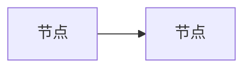

# XSS 样本 15：外链资源静默请求（隐私追踪）

**攻击手法**：不执行任何脚本，纯靠"加载资源"就能把你的行为回传给攻击者——打开文档的时间、次数、IP、甚至通过 URL 里的唯一标识关联到具体用户。这类攻击在邮件与文档场景中极其常见（追踪像素）。

对本项目它对应一条**红线**：渲染管线中外链图片默认不发起网络请求（占位条 + 点击加载）。本样本把所有"能悄悄发请求"的元素集中在一处，作为该红线的固定回归用例。

**预期：脚本不执行、无外网请求。**

**验证方法**：打开本文件 → DevTools Network 面板**清空后重新加载** → 请求列表中 `xss-beacon.example.invalid` 的请求数必须为 **0**（含 img / css / font / fetch / media / prefetch 全类型）→ 外链图片显示为占位条，悬停显示完整 URL。

> **本样本还需验一次"信任此文件"开关**：开启后**只有**远程图片被放行，其他类型（脚本/样式/字体/iframe）仍必须被阻断；关闭后回到零请求。

---

## payload 1：Markdown 图片语法（追踪像素）

## payload 2：HTML img 与响应式属性

<picture>
  <source media="(min-width: 800px)" srcset="https://xss-beacon.example.invalid/15-g.png">
  
</picture>

## payload 3：预加载与预连接（最隐蔽，页面上完全看不见）

<link rel="preload" as="image" href="https://xss-beacon.example.invalid/15-i.png">

<link rel="prefetch" href="https://xss-beacon.example.invalid/15-j.html">

<link rel="preconnect" href="https://xss-beacon.example.invalid">

<link rel="dns-prefetch" href="https://xss-beacon.example.invalid">

<link rel="prerender" href="https://xss-beacon.example.invalid/15-k.html">

## payload 4：图标与清单

<link rel="icon" href="https://xss-beacon.example.invalid/15-l-favicon.ico">

<link rel="apple-touch-icon" href="https://xss-beacon.example.invalid/15-m.png">

<link rel="manifest" href="https://xss-beacon.example.invalid/15-n.webmanifest">

## payload 5：CSS 通道（背景图 / 字体 / @import）

CSS 背景图探针

内联 style 背景图探针

## payload 6：媒体与字幕

<video poster="https://xss-beacon.example.invalid/15-s-poster.jpg" preload="auto" src="https://xss-beacon.example.invalid/15-t.mp4" width="200"></video>

<audio preload="auto" src="https://xss-beacon.example.invalid/15-u.mp3"></audio>

<track src="https://xss-beacon.example.invalid/15-v.vtt">

## payload 7：iframe 与 object（即使不执行脚本也会发请求）

<iframe src="https://xss-beacon.example.invalid/15-w.html" width="1" height="1" style="display:none"></iframe>

<object data="https://xss-beacon.example.invalid/15-x.html" width="1" height="1"></object>

## payload 8：Mermaid 与公式内的外链尝试

预期：Mermaid 图正常渲染，但 `click` 指令定义的外部跳转不得生效（点击节点不发生导航、不发请求）。

## payload 9：混合内容与协议相对地址

---

## 对照组（本地资源必须正常加载）

> **判定口径**：Network 面板中指向 `xss-beacon.example.invalid` 的请求数 = 0（这是 DG 3.2 "外网请求数 = 0" 指标的取数依据）；本地图片正常加载；外链图片显示占位条且 hover 显示完整 URL。
> **导出侧回归**：导出单文件 HTML 后，用浏览器打开产物并再看一次 Network——产物中不得残留任何指向 `xss-beacon.example.invalid` 的引用（外链图片应保持占位形态，不得被"顺手内联"成真实请求）。
